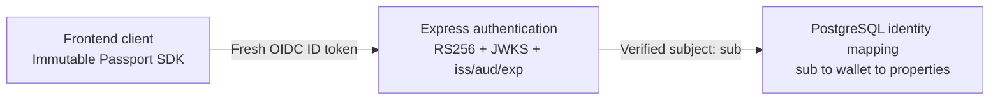

# Immutable Passport integration

## Implemented trust flow

In Passport mode, the frontend sends a fresh ID token in the
`Authorization: Bearer <ID token>` header. The API accepts only RS256 and
verifies the signature through the configured HTTPS JWKS endpoint, exact
issuer, Passport client ID as audience, and token time claims. It requires
`sub`. The optional `sid` claim is retained when the issuer provides it; issuer
and subject identify the mapped account.

The wallet is not read from a request body, query, path, or undocumented token
claim. The verified `sub` resolves through `passport_wallet_bindings`, and the
stored wallet resolves through `wallet_property_access`. `GET
/api/community/me/properties` exposes only that server-owned mapping. A valid
but unmapped identity is forbidden (403); a missing or invalid token is
unauthorized (401).

## Required external configuration

- Create/configure the Passport application in Immutable Hub and obtain its
  public client ID.
- Record the exact issuer emitted for that application/environment; do not
  guess it.
- Register the frontend callback, logout, and allowed origins in the provider.
- Set `VITE_COMMUNITY_DEMO_MODE=false` and provide the public
  `VITE_IMMUTABLE_PASSPORT_CLIENT_ID`, `VITE_IMMUTABLE_REDIRECT_URI`, and
  `VITE_IMMUTABLE_LOGOUT_URI` frontend settings.
- Configure `COMMUNITY_AUTH_MODE=immutable-passport`,
  `IMMUTABLE_PASSPORT_CLIENT_ID`, and `IMMUTABLE_PASSPORT_ISSUER`.
- The default JWKS is `https://auth.immutable.com/.well-known/jwks.json`;
  override `IMMUTABLE_PASSPORT_JWKS_URI` only with the provider-documented
  HTTPS endpoint.
- Populate subject/wallet/property bindings through a reviewed, authenticated
  administrative process. Migration 005 creates storage but deliberately does
  not infer, seed, or trust a client-submitted wallet. The required reviewed
  linking workflow is not implemented in this repository.

No Passport credentials or bearer tokens belong in source control or logs.
The frontend uses the Passport SDK when demo mode is disabled and obtains the
current ID token for each authenticated API call rather than persisting it in
local storage. Its default local demo mode does not load Passport.

If a future linking workflow queries Passport linked addresses, use the
appropriate Passport access token server-side and verify the provider
response. Do not let a caller choose the wallet/property association.

## Development bridge

`COMMUNITY_AUTH_MODE=configured` accepts either an explicit server-owned token
map or the fixed public sample tokens enabled by `COMMUNITY_DEMO_AUTH=true`.
Both are development-only and are refused in production. Memory storage and
demo authentication are also refused in production.
